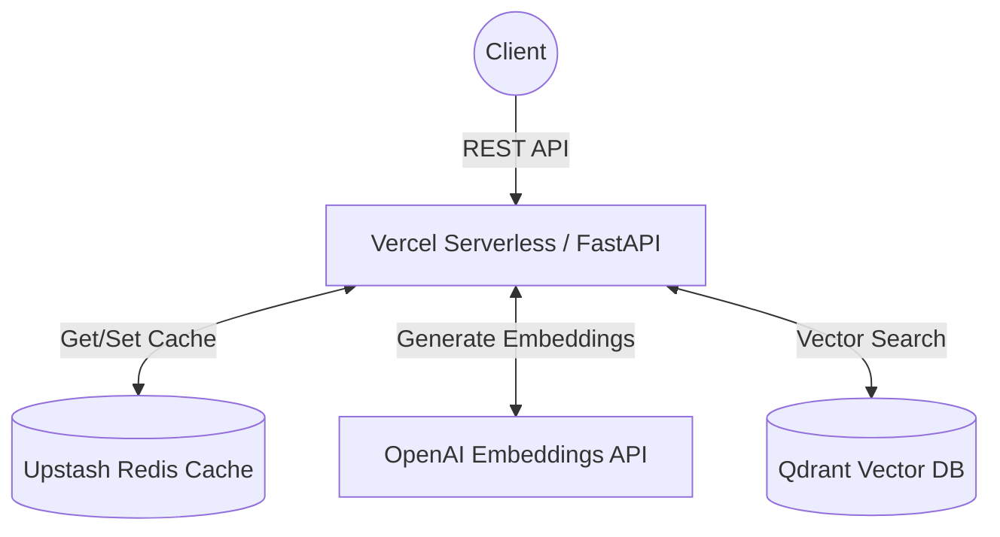

# Scalable Recommendation Microservice with Low-Latency Vector Retrieval & FastAPI Serving

This is a production-minded portfolio project implementing a scalable recommendation microservice. It uses FastAPI for the API, Qdrant for vector similarity search, Upstash Redis for caching, and OpenAI for embeddings.

## Architecture



## Features
- **Low-Latency Architecture**: Designed to run as serverless functions (e.g. Vercel) co-located near Upstash/Qdrant regions.
- **Weighted User Preference Vectors**: Builds real-time user vectors from historical interactions (views, clicks, saves, purchases).
- **Explainable Scores**: Combines semantic similarity, popularity, and freshness with Maximal Marginal Relevance (MMR) diversity.
- **Robust Caching**: Versioned cache keys ensuring deterministic invalidations without expensive wildcard scans.
- **Graceful Degradation**: Fallback to popularity/freshness recommendations if a user has no history.
- **Demo Mode**: Can run entirely locally in-memory with deterministic SHA-256 fallback embeddings for easy testing.

## Local Setup

### 1. Prerequisites
- Python 3.12
- Docker & Docker Compose (for local Qdrant)

### 2. Installation
```bash
# Clone the repository and setup venv
python -m venv venv
# Windows:
venv\Scripts\activate
# Linux/Mac:
# source venv/bin/activate

# Install dependencies
pip install -r requirements.txt
pip install -r requirements-dev.txt
```

### 3. Environment Variables
Copy `.env.example` to `.env`:
```bash
cp .env.example .env
```
To run in production mode with real services, set `DEMO_MODE=false` and configure `QDRANT_URL`, `OPENAI_API_KEY`, `UPSTASH_REDIS_REST_URL`, etc.

### 4. Running Locally (Demo Mode)
Demo mode uses in-memory mock repositories and deterministic fallback embeddings.
```bash
uvicorn app.main:app --reload
```

### 5. Running with Local Qdrant
To test with a real Qdrant instance locally:
```bash
docker-compose up -d
```
Update `.env` to point to `http://localhost:6333` and ensure `DEMO_MODE=false`.

## Deployment to Vercel

This app is configured for Vercel Serverless Functions using the `api/index.py` entrypoint and `vercel.json` configuration.

### Vercel Commands
```bash
# Install Vercel CLI
npm i -g vercel

# Login and link project
vercel

# Deploy to production
vercel --prod
```

### Required Vercel Environment Variables
In the Vercel Dashboard, ensure the following are set for production:
- `ENVIRONMENT` = production
- `DEMO_MODE` = false
- `OPENAI_API_KEY`
- `QDRANT_URL` and `QDRANT_API_KEY`
- `UPSTASH_REDIS_REST_URL` and `UPSTASH_REDIS_REST_TOKEN`
- `ADMIN_API_KEY`
- `CORS_ORIGINS` (e.g. `["https://your-frontend-domain.com"]`)

## Example API Calls

### Seed the Catalog
```bash
curl -X POST http://localhost:8000/v1/catalog/seed \
  -H "X-API-Key: your-admin-api-key-here"
```

### Get Recommendations
```bash
curl -X POST http://localhost:8000/v1/recommendations \
  -H "Content-Type: application/json" \
  -d '{
    "user_id": "user_123",
    "limit": 5,
    "diversity": 0.2
  }'
```

## Load Testing
A sample `k6` script is provided in `scripts/load_test.js`. Do not promise a latency target until you run this script against your actual deployment topology (e.g. Vercel function in `iad1` with Upstash in `us-east-1` and Qdrant Cloud in AWS `us-east-1`).
```bash
k6 run scripts/load_test.js
```

## Production Trade-offs & Limitations
- **Serverless Timeouts**: Vercel Hobby limits functions to 10 seconds. Qdrant/Redis timeouts must be strictly configured below this threshold.
- **Interaction Persistence**: Currently, interactions are stored in a bounded Redis list per user for low latency. In a high-scale production system, durable interactions should be streamed to Kafka/Postgres, with Redis acting only as a fast read-replica of the materialized user profile.
- **Batching limits**: The synchronous `/v1/items/batch-upsert` endpoint is capped at 50 items to prevent Vercel timeouts. Large catalog syncs should be performed via dedicated background workers or CLI scripts, not API endpoints.
